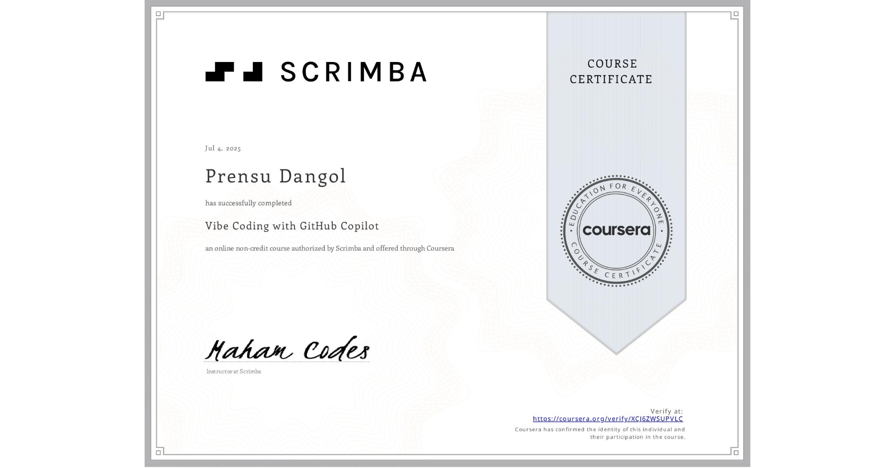

# 🧠 RAG-based Question Answering System using Transformers and FAISS

This repository contains an implementation of a **Retriever-Augmented Generation (RAG)** system that enables question-answering over custom documents. It combines **Dense Passage Retrieval (DPR)** with a **language generation model (GPT2)** to produce answers grounded in a relevant context.



---

## 📌 What is RAG?

RAG (Retriever-Augmented Generation) is a hybrid NLP framework that integrates two components:

1. **Retriever**: Finds relevant chunks of information from a corpus (e.g., company policy documents).
2. **Generator**: Uses a sequence-to-sequence model to generate a natural language answer based on the retrieved information.

This combination helps large language models give accurate answers that are grounded in actual data instead of hallucinating responses.

---

## 🔁 RAG Pipeline Overview

### 1. **Tokenization**

- Input paragraphs are first tokenized using `DPRContextEncoderTokenizer`.
- Tokenization converts text into token IDs and applies:
  - **Padding**: to make all sequences uniform in length.
  - **Truncation**: to cut long paragraphs at a maximum length (e.g., 256 tokens).

```python
inputs = context_tokenizer(text, return_tensors='pt', padding=True, truncation=True, max_length=256)
outputs = context_encoder(**inputs)
embedding = outputs.pooler_output
```

### 2. **Context Encoding**

- After tokenization, the `DPRContextEncoder` transforms text into dense vector embeddings (contextual representations).
- The `.pooler_output` of the encoder is used, which captures the overall semantic meaning of each paragraph.

```python
inputs = context_tokenizer(text, return_tensors='pt', padding=True, truncation=True, max_length=256)
outputs = context_encoder(**inputs)
embedding = outputs.pooler_output
```

### 3. **FAISS Index Creation**

- A **FAISS (Facebook AI Similarity Search)** index is used to store and retrieve paragraph embeddings efficiently.
- FAISS enables fast nearest-neighbor searches to retrieve top-k most relevant passages.

```python
index = faiss.IndexFlatL2(embedding_dimension)
index.add(context_embeddings)
```

### 4. **Query Encoding and Retrieval**

- The input question is encoded using the `DPRQuestionEncoder`.
- The resulting query vector is used to search the FAISS index and retrieve top-k context passages.

```python
query_embedding = question_encoder(**tokenizer(question)).pooler_output
_, topk_indices = index.search(query_embedding, k=3)
retrieved_contexts = [paragraphs[i] for i in topk_indices[0]]
```

### 5. **Answer Generation with GPT2**

- The top-k retrieved contexts are concatenated with the query and passed to `GPT2LMHeadModel` to generate an answer.
- The generation can be tuned using parameters like:
  - `max_length`
  - `min_length`
  - `length_penalty`
  - `num_beams`

```python
input_text = f"Context: {retrieved_context}
Question: {question}
Answer:"
generated = gpt2.generate(...)
```

---

## 🧪 Example Use Case

**Q**: *"How do I submit a reimbursement request?"*  
**A**: The model retrieves the HR policy paragraph and answers: *"You can submit reimbursement requests via the employee portal using the reimbursement form."*

---

## 🛠️ Libraries Used

- `transformers` (for DPR, GPT2)
- `torch` (for model inference)
- `faiss-cpu` or `faiss-gpu` (for vector indexing)
- `sklearn.manifold.TSNE` (for optional embedding visualization)

---

## 📂 Folder Structure

```
├── encode_contexts.py          # Context embedding logic
├── build_faiss_index.py       # FAISS index construction
├── query_and_generate.py      # Full RAG pipeline execution
├── utils.py                   # Utility functions
└── README.md                  # This file
```

---

## ✅ Summary

RAG systems enable LLMs to **retrieve** and **generate** simultaneously, providing grounded, accurate responses based on a knowledge base. This project demonstrates a hands-on implementation using DPR, GPT2, and FAISS.

---

**Author**: *Your Name Here*  
**License**: MIT
